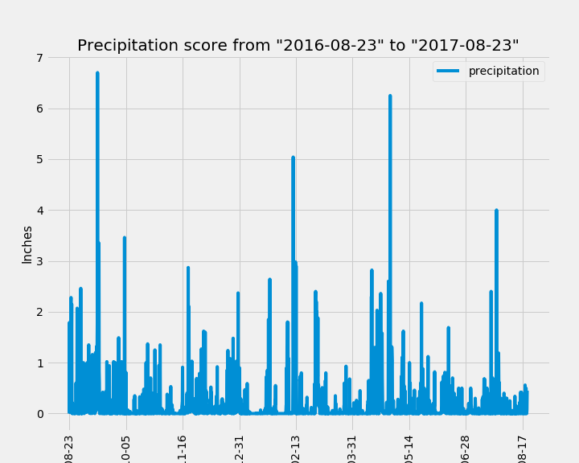
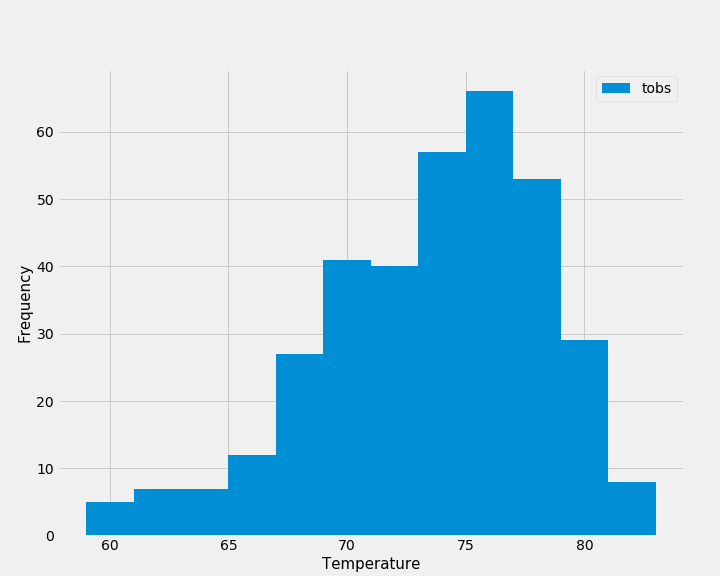
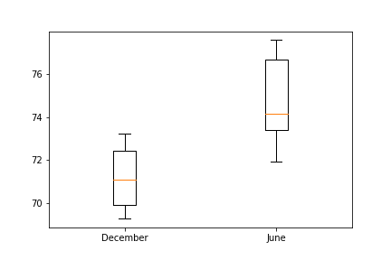

# sqlalchemy-challenge

### Part 1: Climate Analysis and Exploration
In this section, you’ll use Python and SQLAlchemy to perform basic climate analysis and data exploration of your climate database. Complete the following tasks by using SQLAlchemy ORM queries, Pandas, and Matplotlib.

* Use the provided [starter notebook](climate_starter.ipynb) and [hawaii.sqlite](Resources) files to complete climate analysis and data exploration.

#### Precipitation Analysis

 
#### Station Analysis

* Plot the results as a histogram with `bins=12`, as shown in the following image:


    
    
### Part 2: Design Your Climate App
List all available routes.
* `/`
* `/api/v1.0/precipitation`
* `/api/v1.0/stations`
* `/api/v1.0/tobs`
* `/api/v1.0/<start>` and `/api/v1.0/<start>/<end>`

* Use the provided [app.py](app.py) to review the script created for all the above routes

### Bonus: Other Recommended Analyses

#### Temperature Analysis 
* Use the provide [temp_analysis_bonus_1_starter.ipynb](temp_analysis_bonus_1_starter.py) to review code

* ```Question``` :Use the t-test to determine whether the difference in means, if any, is statistically significant. Will you use a paired t-test or an unpaired t-test? Why?

  ```Answer```  :I will use the t-test to determine if the average temperatures between June and December are statistically significantly different. Will use the unpaired t-test   because I am comparing means from separate groups by month that are not dependent on each other.

* H0: The difference between the mean temperatures of June and December is equal to zero
  H1: The difference between the mean temperatures of June and June and December is NOT equal to zero 

* Ttest_indResult(statistic=-4.615865424404701, pvalue=0.00028626292761018595)



* p-value is less than 0.05, We can reject the null hypothesis and conclude that the difference in means is statistically significant in temperature between June and December.
